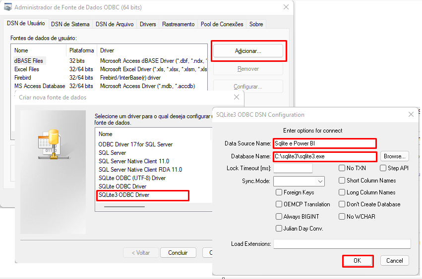
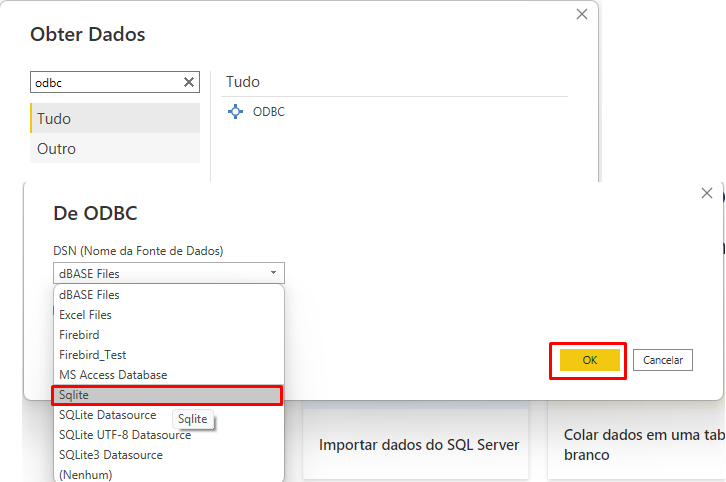

# Projeto de PowerBI
Aplicação de uma administradora de condomínios hipotética para análise de
inadimplência condominial e seus impactos.

## Fontes dos dados
- [Base para os condôminos](https://www.kaggle.com/datasets/gauravduttakiit/loan-defaulter) 
- [Base para os condomínios](https://www.kaggle.com/datasets/gohyuchen/singapore-private-condo-rental)

Os demais dados foram gerados aleatoriamente com certas restrições.

## Sobre os dados

Os mesmos foram alterados através de um [script python](./data/parser.ipynb) gerando novos dados que permitam possuir uma relação entre os dados de condomínios, condôminos e faturas.
Esses dados foram tratados utilizando Pandas e o Power Query do Power BI.

## Como utilizar o Power BI com JSON
Modifique a variável `FonteDados` no PowerQuery com o caminho da pasta que
contém o arquivo JSON.

## Como utilizar o Power BI com o SQLite
Instale o [ODBC Driver](http://www.ch-werner.de/sqliteodbc/) do SQLite e siga
as instruções de instalação:

| O driver que funcionou bem para mim foi o da [Devart Software](https://marketplace.visualstudio.com/items?itemName=DevartSoftware.SQLiteODBCDriver3264bit).

O campo `Data Source Name` deve ser `SQLite` para funcionar de forma mais automática.

